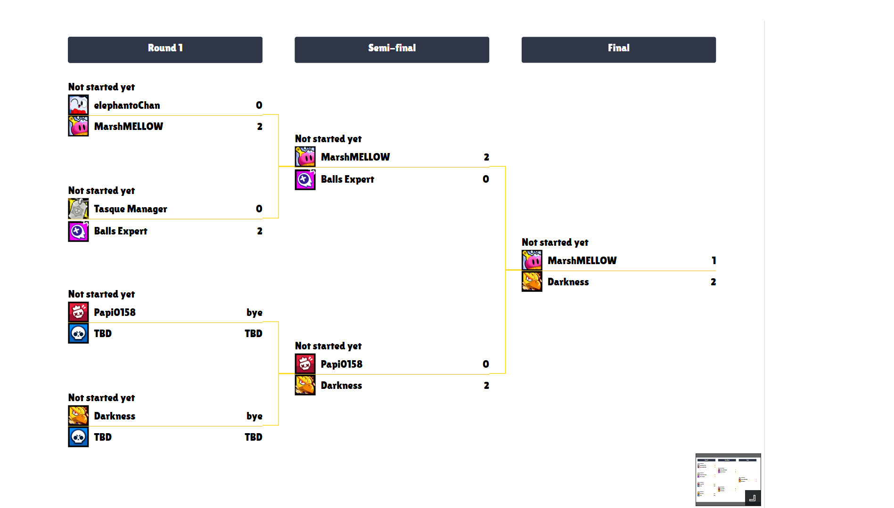

# Tournament Hosting Application

Welcome to our Tournament Hosting Application! This application leverages several modern technologies to provide a seamless and interactive experience for hosting and managing tournaments. Below is a detailed breakdown of the components and setup instructions.

## Table of Contents

- [Tournament Hosting Application](#tournament-hosting-application)
  - [Table of Contents](#table-of-contents)
  - [Overview](#overview)
  - [Features](#features)
  - [Technologies Used](#technologies-used)
  - [Prerequisites](#prerequisites)
  - [Installation](#installation)
  - [Contributing](#contributing)
  - [License](#license)
  - [Sample](#sample)

## Overview

This application integrates various components to offer a complete solution for tournament hosting. It includes a Discord bot for interaction, a web interface for bracket management, image processing for visual content, and a robust backend to store and manage data.

## Features

- **Discord Bot**: Manage tournaments, register participants, and communicate updates via Discord.
- **Web Interface**: Interactive bracket hosting and management using Next.js.
- **Image Processing**: Generate and manipulate images for tournament brackets and results using Python and Pillow.
- **Database Management**: Store tournament data, participant information, and match results using PostgreSQL.
- **Docker Compose**: Simplified deployment with Docker Compose.

## Technologies Used

- **Rust**: For developing the Discord bot.
- **Python**: For image processing tasks using Pillow.
- **Next.js**: For building the web interface to view bracket dynamically.
- **PostgreSQL**: For database management.
- **Docker Compose**: For container orchestration and deployment.

## Prerequisites

Before you begin, ensure you have the following installed:

- Docker and Docker Compose
- Rust and Cargo
- Python 3.x and pip
- Node.js and npm/yarn
- PostgreSQL

## Installation

1. **Clone the repository**: Literally.
2. **Set up the environment variables**:
    Create a `.env` file in the root directory and add the necessary environment variables for PostgreSQL, Discord bot, and any other configurations. Follow .env.example

3. **Build and run the Docker containers**:
    ```sh
    docker-compose up --build up -d
    ```

4. **Set up the PostgreSQL database**:
    Ensure PostgreSQL is running and create the required databases and tables.

## Contributing

Contributions are welcome! Please fork the repository and create a pull request with your changes. Ensure your code follows the project's coding standards and includes relevant tests.

## License

This project is licensed under the MIT License. See the [LICENSE](LICENSE) file for more details.

## Sample
